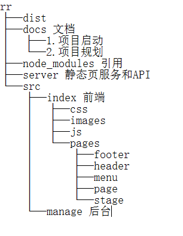
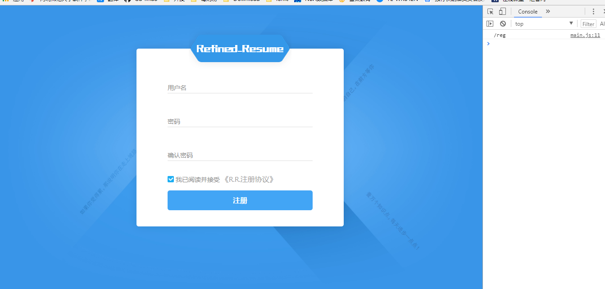
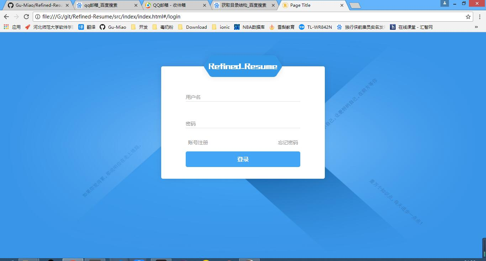
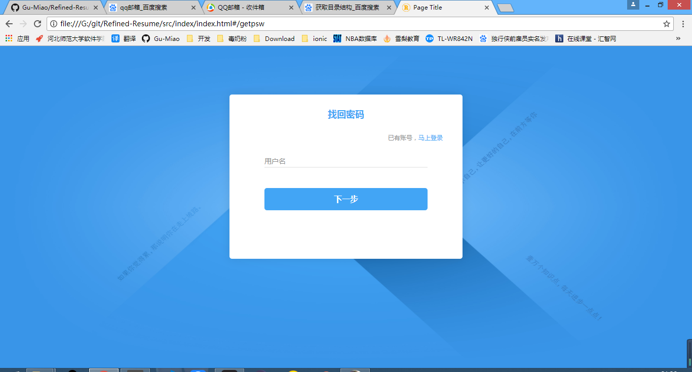
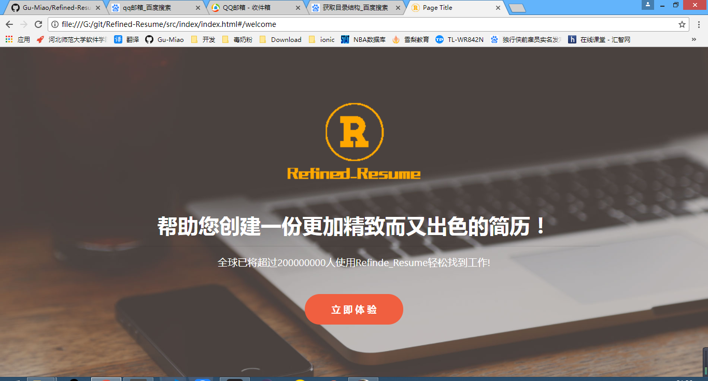
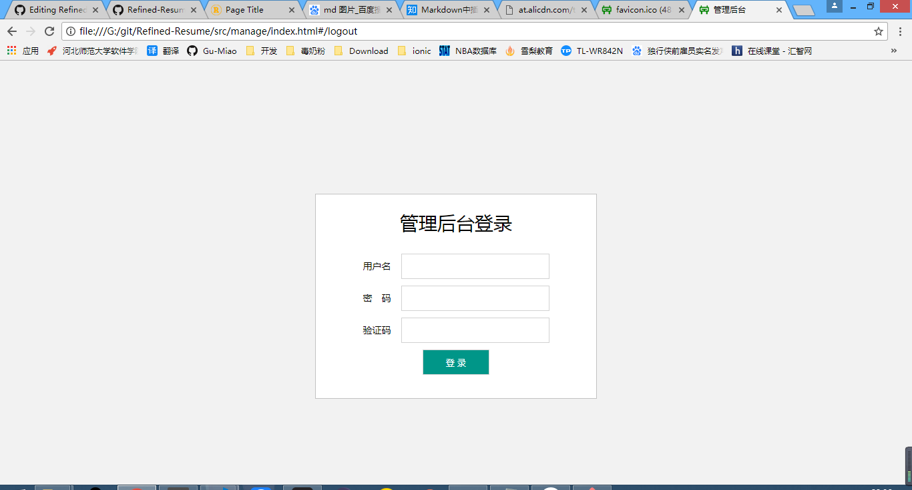
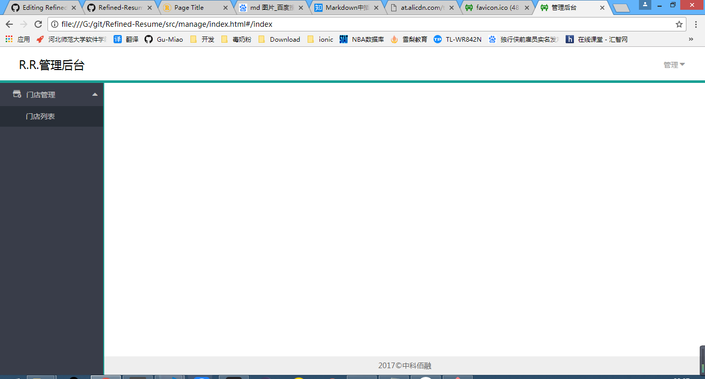

# 第一次展示

## 仓库目录结构



## 前端

* 前端页面入口（index.html）
 ```html
 <!DOCTYPE html>
<html>
<head>
    <meta charset="utf-8" />
    <meta http-equiv="X-UA-Compatible" content="IE=edge">
    <title>Page Title</title>
    <meta name="viewport" content="width=device-width, initial-scale=1">
    <link rel="icon" href="images/favicon.png">
    <link rel="stylesheet" type="text/css" href="css/bootstrap.min.css" />
    <link rel="stylesheet" type="text/css" href="css/main.css" />
    <link rel="stylesheet" type="text/css" href="css/header.css" />
    <link rel="stylesheet" type="text/css" href="css/register.css" />
    <link rel="stylesheet" type="text/css" href="css/login.css" />
    <link rel="stylesheet" type="text/css" href="css/getpsw.css">
    <link rel="stylesheet" type="text/css" href="css/menu.css" />
    <link rel="stylesheet" type="text/css" href="css/footer.css" />
    <link rel="stylesheet" type="text/css" href="css/stage.css" />
    <link rel="stylesheet" type="text/css" href="css/welcome.css" />
</head>
<body>
    <div id="rr"></div>
<script src="js/config.js"></script>
<script src="js/jquery.min.js"></script>
<script src="js/welcome.js"></script>
<script src="js/register.js"></script>
<script src="js/login.js"></script>
<script src="js/getpsw.js"></script>
<script src="js/header.js"></script>
<script src="js/menu.js"></script>
<script src="js/stage.js"></script>
<script src="js/footer.js"></script>
<script src="js/main.js"></script>
</body>
</html>
 ```

 * 注册界面  
 
 * 登录界面  
 
 * 忘记密码界面  
 
 * 欢迎界面  
 
 
 ## 后台/数据库
 
 后台/数据库使用 node.js 和 mongodb  
 * 后天页面入口文件
 ```html
<!DOCTYPE html>
<html lang="en">
<head>
  <meta charset="UTF-8">
  <meta http-equiv="X-UA-Compatible" content="IE=edge,chrome=1">
  <title>管理后台</title>
  <link rel="stylesheet" href="css/font_604203_ud0lq1xob1nvobt9.css">
  <link rel="stylesheet" href="css/normalize.css">
  <link rel="stylesheet" href="css/c-login.css">
  <link rel="stylesheet" href="css/c-header.css">
  <link rel="stylesheet" href="css/c-menu.css">
  <link rel="stylesheet" href="css/c-stage.css">
  <link rel="stylesheet" href="css/c-footer.css">
  <link rel="stylesheet" href="css/p-change-password.css">
  <link rel="stylesheet" href="css/app.css">
  <link rel="icon" href="images/favicon.ico" sizes="48x48" type="image/png">
</head>
<body>
<div id="admin-app">
</div>
<script src="js/jquery.min.js"></script>
<script src="js/config.js"></script>
<script src="js/c-login.js"></script>
<script src="js/c-header.js"></script>
<script src="js/c-menu.js"></script>
<script src="js/c-stage.js"></script>
<script src="js/c-footer.js"></script>
<script src="js/p-store-list.js"></script>
<script src="js/p-change-password.js"></script>
<script src="js/app.js"></script>
</body>
</html>
 ```
 * 登录界面
 
 * 主页
 
